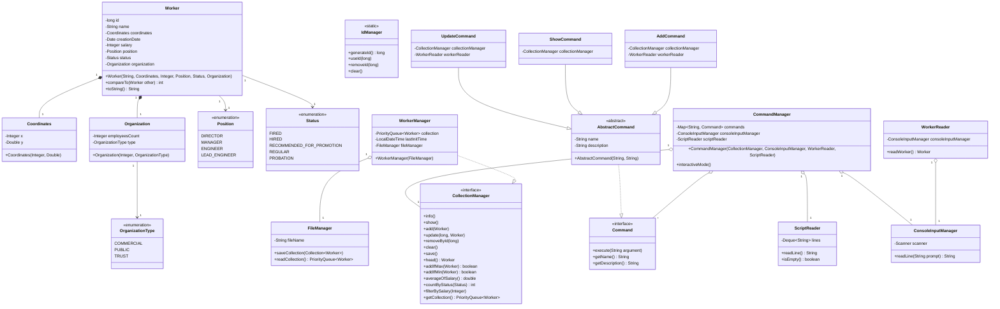

# Java Class Diagram - Lab5

```mermaid
classDiagram
    %% Models
    class Worker {
        -long id
        -String name
        -Coordinates coordinates
        -Date creationDate
        -Integer salary
        -Position position
        -Status status
        -Organization organization
        +Worker(String, Coordinates, Integer, Position, Status, Organization)
        +compareTo(Worker other) int
        +toString() String
    }

    class Coordinates {
        -Integer x
        -Double y
        +Coordinates(Integer, Double)
    }

    class Organization {
        -Integer employeesCount
        -OrganizationType type
        +Organization(Integer, OrganizationType)
    }

    class Position {
        <<enumeration>>
        DIRECTOR
        MANAGER
        ENGINEER
        LEAD_ENGINEER
    }

    class Status {
        <<enumeration>>
        FIRED
        HIRED
        RECOMMENDED_FOR_PROMOTION
        REGULAR
        PROBATION
    }

    class OrganizationType {
        <<enumeration>>
        COMMERCIAL
        PUBLIC
        TRUST
    }

    Worker "1" *-- "1" Coordinates
    Worker "1" *-- "1" Organization
    Worker "1" --> "1" Position
    Worker "1" --> "1" Status
    Organization "1" --> "1" OrganizationType

    %% Managers
    class CollectionManager {
        <<interface>>
        +info()
        +show()
        +add(Worker)
        +update(long, Worker)
        +removeById(long)
        +clear()
        +save()
        +head() Worker
        +addIfMax(Worker) boolean
        +addIfMin(Worker) boolean
        +averageOfSalary() double
        +countByStatus(Status) int
        +filterBySalary(Integer)
        +getCollection() PriorityQueue~Worker~
    }

    class WorkerManager {
        -PriorityQueue~Worker~ collection
        -LocalDateTime lastInitTime
        -FileManager fileManager
        +WorkerManager(FileManager)
    }

    class CommandManager {
        -Map~String, Command~ commands
        -ConsoleInputManager consoleInputManager
        -ScriptReader scriptReader
        +CommandManager(CollectionManager, ConsoleInputManager, WorkerReader, ScriptReader)
        +interactiveMode()
    }

    class FileManager {
        -String fileName
        +saveCollection(Collection~Worker~)
        +readCollection() PriorityQueue~Worker~
    }

    class IdManager {
        <<static>>
        +generateId() long
        +useId(long)
        +removeId(long)
        +clear()
    }

    WorkerManager ..|> CollectionManager
    WorkerManager "1" o-- "1" FileManager
    CommandManager "1" o-- "*" Command
    CommandManager "1" o-- "1" CollectionManager

    %% Commands
    class Command {
        <<interface>>
        +execute(String argument)
        +getName() String
        +getDescription() String
    }

    class AbstractCommand {
        <<abstract>>
        -String name
        -String description
        +AbstractCommand(String, String)
    }

    class AddCommand {
        -CollectionManager collectionManager
        -WorkerReader workerReader
    }

    class ShowCommand {
        -CollectionManager collectionManager
    }

    class UpdateCommand {
        -CollectionManager collectionManager
        -WorkerReader workerReader
    }

    AbstractCommand ..|> Command
    AddCommand --|> AbstractCommand
    ShowCommand --|> AbstractCommand
    UpdateCommand --|> AbstractCommand
    %% ... other commands following same pattern

    %% IO
    class ConsoleInputManager {
        -Scanner scanner
        +readLine(String prompt) String
    }

    class WorkerReader {
        -ConsoleInputManager consoleInputManager
        +readWorker() Worker
    }

    class ScriptReader {
        -Deque~String~ lines
        +readLine() String
        +isEmpty() boolean
    }

    WorkerReader "1" o-- "1" ConsoleInputManager
    CommandManager "1" o-- "1" ConsoleInputManager
    CommandManager "1" o-- "1" ScriptReader
```
