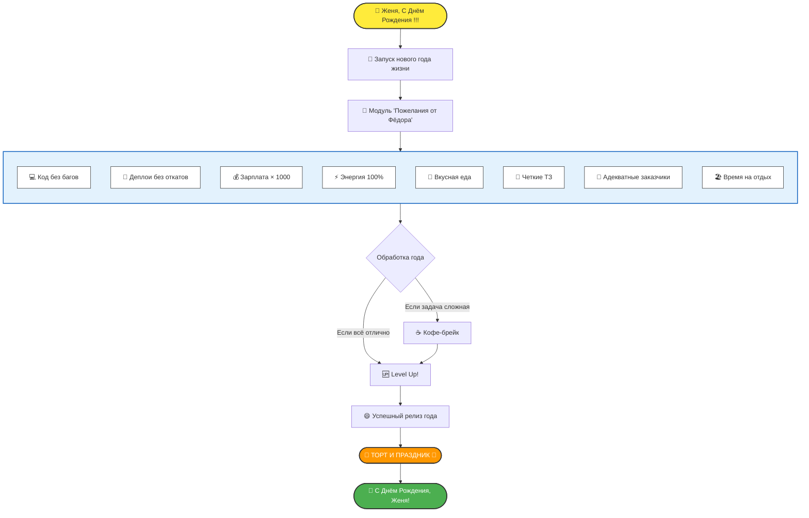

```mermaid
flowchart TD
    Start([🎂 Женя, C Днём Рождения !!!]) --> Init[🚀 Запуск нового года жизни]
    
    Init --> SubGraphStart[🎁 Модуль 'Пожелания от Фёдора']
    
    subgraph PodarokOtFedora [ ]
        direction TB
        P1[💻 Код без багов]
        P2[🚀 Деплои без откатов]
        P3[💰 Зарплата × 1000]
        P4[⚡️ Энергия 100%]
        P5[🍕 Вкусная еда]
        P6[🎯 Четкие ТЗ]
        P7[👥 Адекватные заказчики]
        P8[🏖 Время на отдых]
    end
    
    SubGraphStart --> PodarokOtFedora
    PodarokOtFedora --> Process{Обработка года}
    
    Process -->|Если задача сложная | Coffee[☕️ Кофе-брейк]
    Process -->|Если всё отлично | LevelUp[🆙 Level Up!]
    Coffee --> LevelUp
    
    LevelUp --> Success[😄 Успешный релиз года]
    Success --> Celebration([🎉 ТОРТ И ПРАЗДНИК 🎉])
    
    Celebration --> Final([🥂 С Днём Рождения, Женя!])
    
    style Start fill:#ffeb3b,stroke:#333,stroke-width:2px
    style PodarokOtFedora fill:#e3f2fd,stroke:#1565c0,stroke-width:2px
    style Celebration fill:#ff9800,stroke:#333,stroke-width:2px,color:#fff
    style Final fill:#4caf50,stroke:#333,stroke-width:2px,color:#fff
    style P1 fill:#fff,stroke:#333,stroke-width:1px
    style P2 fill:#fff,stroke:#333,stroke-width:1px
    style P3 fill:#fff,stroke:#333,stroke-width:1px
    style P4 fill:#fff,stroke:#333,stroke-width:1px
    style P5 fill:#fff,stroke:#333,stroke-width:1px
    style P6 fill:#fff,stroke:#333,stroke-width:1px
    style P7 fill:#fff,stroke:#333,stroke-width:1px
    style P8 fill:#fff,stroke:#333,stroke-width:1px
```