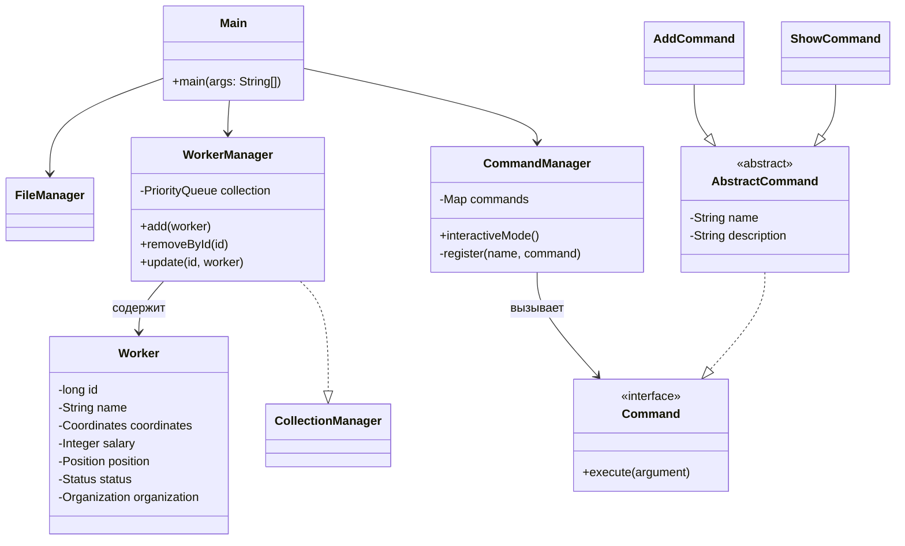

# Гайд по защите Лабораторной работы №5

Этот документ поможет тебе понять структуру твоего кода, объяснить его преподавателю и успешно защитить работу.

---

## 1. Архитектура проекта

Проект построен на принципах разделения ответственности и паттерне **Command (Команда)**.

### Основные пакеты:
- **`worker`**: Слой данных (POJO). Здесь хранятся классы, описывающие объекты ([Worker](file:///C:/Users/Zenbo/javaWorks/Lab5/src/io/WorkerReader.java#16-27), [Coordinates](file:///C:/Users/Zenbo/javaWorks/Lab5/src/io/WorkerReader.java#28-41), [Organization](file:///C:/Users/Zenbo/javaWorks/Lab5/src/io/WorkerReader.java#42-50)) и перечисления ([Status](file:///C:/Users/Zenbo/javaWorks/Lab5/src/managers/WorkerManager.java#118-124), `Position`).
- **`managers`**: Слой бизнес-логики.
    - [WorkerManager](file:///C:/Users/Zenbo/javaWorks/Lab5/src/managers/WorkerManager.java#13-137): Управляет коллекцией `PriorityQueue`. Все операции над данными (добавление, удаление, поиск) проходят через него.
    - [FileManager](file:///C:/Users/Zenbo/javaWorks/Lab5/src/managers/FileManager.java#13-139): Отвечает за сохранение в файл и загрузку. Реализован кастомный парсер JSON (без сторонних библиотек), что часто ценится преподавателями.
    - [CommandManager](file:///C:/Users/Zenbo/javaWorks/Lab5/src/managers/CommandManager.java#14-78): "Диспетчер" команд. Регистрирует команды и сопоставляет ввод пользователя с объектами команд.
    - `IdManager`: Гарантирует уникальность ID рабочих.
- **`commands`**: Реализация паттерна Команда. Каждая операция (save, add, show и т.д.) — это отдельный класс. Это позволяет легко расширять программу, не меняя основной код.
- **[io](file:///C:/Users/Zenbo/javaWorks/Lab5/src/managers/WorkerManager.java#132-136)**: Слой взаимодействия с пользователем. [WorkerReader](file:///C:/Users/Zenbo/javaWorks/Lab5/src/io/WorkerReader.java#9-116) отвечает за валидацию ввода — программа не "упадет", если пользователь введет строку вместо числа.
- **`exceptions`**: Специфичные для проекта ошибки.

---

## 2. Схема кода (Диаграмма классов)

---

## 3. Как объяснять работу (Презентация)

1.  **Начни с технологий**: "Программа написана на Java. Для хранения данных используется `PriorityQueue`, что обеспечивает автоматическую сортировку элементов (поскольку [Worker](file:///C:/Users/Zenbo/javaWorks/Lab5/src/io/WorkerReader.java#16-27) реализует интерфейс `Comparable`)."
2.  **Объясни структуру**: "Проект разделен на пакеты для упрощения поддержки. Используется паттерн Команда, чтобы каждая операция была изолирована."
3.  **Выдели особенности**: "Я реализовал собственный парсер JSON для работы с файлами, используя регулярные выражения. Это позволило избежать использования внешних библиотек (как того требует задание)."
4.  **Валидация**: "Программа устойчива к некорректному вводу: все поля проверяются в классе [WorkerReader](file:///C:/Users/Zenbo/javaWorks/Lab5/src/io/WorkerReader.java#9-116) перед созданием объекта."

---

## 4. Ответы на вопросы к защите

### 1. Почему PriorityQueue?
Это очередь с приоритетом. Она автоматически упорядочивает элементы при добавлении. Порядок определяется методом `compareTo` в классе [Worker](file:///C:/Users/Zenbo/javaWorks/Lab5/src/io/WorkerReader.java#16-27).

### 2. В чем разница между Comparable и Comparator?
- `Comparable` (интерфейс в классе [Worker](file:///C:/Users/Zenbo/javaWorks/Lab5/src/io/WorkerReader.java#16-27)) определяет сортировку "по умолчанию" внутри самого объекта.
- `Comparator` — это отдельный объект, который можно передать в метод сортировки, чтобы отсортировать коллекцию нестандартным способом (например, по ID, по имени или по зарплате).

### 3. Как работает JSON-парсер в FileManager?
Я использовал символьные потоки (`FileReader`) для чтения файла. С помощью регулярных выражений я нахожу блоки `{...}` и извлекаю значения по ключам. Для записи используются байтовые потоки (`FileOutputStream`).

### 4. Зачем нужен CommandManager?
Чтобы избежать огромного блока `if-else` в методе [main](file:///C:/Users/Zenbo/javaWorks/Lab5/src/Main.java#9-30). Если нужно будет добавить шестнадцатую команду, мы просто создадим новый класс и добавим одну строчку в конструктор [CommandManager](file:///C:/Users/Zenbo/javaWorks/Lab5/src/managers/CommandManager.java#14-78).

---

## 5. Полезный совет
Если преподаватель спросит про **Javadoc**, покажи комментарии над методами и классами, начинающиеся с `/**`. Если спросит про **Generic (Параметризацию)**, покажи `PriorityQueue<Worker>` — это гарантирует, что в очереди будут только объекты класса [Worker](file:///C:/Users/Zenbo/javaWorks/Lab5/src/io/WorkerReader.java#16-27).
